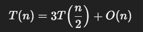
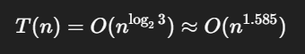
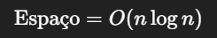
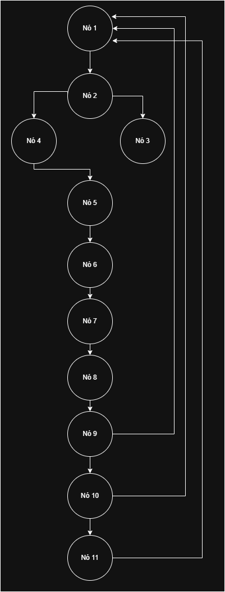

# Implementação do Algoritmo de Karatsuba em Python

**Trabalho Individual 1 da disciplina de Fundamentos de Projetos e Análise de Algoritmos.**

## Objetivo

Desenvolver um programa em Python que implemente o algoritmo de Karatsuba para multiplicação eficiente de dois números inteiros.

## O que é o Algoritmo de Karatsuba?

O algoritmo de Karatsuba é uma técnica eficiente para multiplicação de números inteiros grandes, introduzida por Anatolii Karatsuba em 1960. Ele melhora a complexidade da multiplicação em comparação ao método tradicional de multiplicação direta.

## Explicação do Algoritmo

### Implementação Algoritmo de Karatsuba

```python
def karatsuba(num_x, num_y):

    if num_x < 10 or num_y < 10:
        return num_x * num_y

    s = max(len(str(num_x)), len(str(num_y)))
    m = s // 2

    alta_x, baixa_x = divmod(num_x, 10 ** m)
    alta_y, baixa_y = divmod(num_y, 10 ** m)

    z0 = karatsuba(baixa_x, baixa_y)
    z1 = karatsuba((baixa_x + alta_x), (baixa_y + alta_y))
    z2 = karatsuba(alta_x, alta_y)

    return (z2 * 10 ** (2 * m)) + ((z1 - z2 - z0) * 10 ** m) + z0

if __name__ == "__main__":

    num_x = int(input("Digite o primeiro número: "))
    num_y = int(input("Digite o segundo número: "))

    resultado = karatsuba(num_x, num_y)

    print(f"O produto de {num_x} e {num_y} é:")
    print(resultado)

    print("\nVerificação com a multiplicação padrão do Python:")
    print(num_x * num_y)

    assert resultado == num_x * num_y
    print("\n✅ Resultado verificado com sucesso!")
```

### Algoritmo com explicações

A função karatsuba(num_x, num_y) implementa o algoritmo de Karatsuba seguindo a estratégia de "dividir para conquistar".

1. Caso Base

    É utilizado a condição de parada, o metodo recursivo é aplicado até que os números fiquem pequenos o suficiente para usar a multiplicação normal.
    ```python
    if num_x < 10 or num_y < 10:
        return num_x * num_y
    ```
2. Calculo do ponto de divisão
   
    Descobre o tamanho "s" dos números para encontrar um ponto médio e dividí-los em duas metades.
    ```python
    s = max(len(str(num_x)), len(str(num_y)))
    m = s // 2
    ```
3. Divisão dos números
   
   Usando a função `divmod`, os números são divididos em uma parte "alta" (os dígitos mais significativos) e uma parte "baixa" (os dígitos menos significativos).
    ```python
    alta_x, baixa_x = divmod(num_x, 10 ** m)
    alta_y, baixa_y = divmod(num_y, 10 ** m)
    ```
4. Chamadas recursivas

    Utiliza a recursividade para o cálculo de (z0, z1 e z2) as três multiplicações da fórmula de Karatsuba, ara dividir o "problema grande em subproblemas menores", cada chamada é uma nova instância do problema, mas com números menores.
   ```python
   z0 = karatsuba(baixa_x, baixa_y)
   z1 = karatsuba((baixa_x + alta_x), (baixa_y + alta_y))
   z2 = karatsuba(alta_x, alta_y)
   ```
5. Combinação dos Resultados
   
    Aplica a formula final do Algoritmo de Karatsuba usando os resultados de z0, z1 e z2
   
   ```python
     return (z2 * 10 ** (2 * m)) + ((z1 - z2 - z0) * 10 ** m) + z0
    ```
6. Bloco de Execução Principal

   O bloco de código sob a condição `if __name__ == "__main__":` serve como o ponto de entrada do programa.

7. Entrada de Dados do Usuário
   
   O programa solicita que o usuário digite dois números através do console.
   ```
   num_x = int(input("Digite o primeiro número: "))
   num_y = int(input("Digite o segundo número: "))
   ```
8. Execução do Algoritmo
   
   Aqui, a função karatsuba, que contém a lógica principal do projeto, é chamada.
   ```python
   resultado = karatsuba(num_x, num_y)
   ```
9. Exibição do Resultado:
    ```python
   print("\nUtilizando o algoritmo de Karatsuba")
   print(f"O produto de {num_x} e {num_y} é:")
   print(resultado)
   ```
    
10. Verificação com metodo padrão:
       ```python
       print("\nVerificação com a multiplicação padrão do Python:")
       print(num_x * num_y)
       ```

11. Asserção Programática:
       ```python
       assert resultado == num_x * num_y
       print("\n✅ Resultado verificado com sucesso!")
       ```
## Como executar o projeto

1. Clone o repositório:
```Bash
git clone https://github.com/gabrieltinoco/Algoritmo-De-Karatsuba-Em-Python.git
```
2. Navegue até o diretório do projeto:
```Bash
cd Algoritmo-De-Karatsuba-Em-Python
```
3. Execute o script Python:
```Bash
python main.py
```
4. Digite os dois números para realizar a multiplicação através do Algoritmo de Karatsuba


## Relatório Técnico

### O que é a Complexidade Assintótica?

A **complexidade assintótica** é uma maneira de expressar o comportamento de um algoritmo quando o tamanho da entrada tende ao infinito. Ela descreve o tempo ou espaço de execução de um algoritmo em termos do tamanho da entrada, ignorando fatores como o hardware ou o tempo de execução real. A complexidade assintótica ajuda a comparar a eficiência de diferentes algoritmos de forma mais objetiva, independentemente das condições do sistema.

#### Complexidade Assintótica Temporal do Algoritmo:

O algoritmo divide o problema de multiplicar dois números de 𝑛 dígitos em 3 multiplicações recursivas, cada uma com aproximadamente 𝑛/2 dígitos.

Ou seja, a recorrência é:



Aplicando o teorema mestre:



O termo "3𝑇(𝑛/2)" vem das três chamadas recursivas (z0, z1, z2).
O termo 𝑂(𝑛)vem das operações adicionais:
* somas e subtrações de inteiros 𝑂(𝑛);
* conversões `len(str(num_x))` (também 𝑂(𝑛));
* multiplicação por potências de 10 no Python com inteiros arbitrários é 𝑂(𝑛);


#### Complexidade Assintótica Espacial do Algoritmo:

Espaço usado:

* Cada chamada cria novos inteiros a partir das divisões (divmod) e somas.
* A profundidade da recursão é (pois cada vez o tamanho do número cai pela metade).
* Em cada nível, armazenamos alguns inteiros de tamanho até 𝑂(𝑛).

Logo:



Isso porque:

* Em profundidade máxima (log 𝑛 níveis), cada nível carrega até 𝑂(𝑛) bits de informação.

* Python usa inteiros arbitrários, então o espaço cresce proporcional ao número de dígitos.

### O que é a Complexidade Ciclomática?

A **complexidade ciclomática** é uma métrica usada para medir a complexidade do fluxo de controle de um programa. Ela calcula o número de caminhos independentes no código, considerando estruturas como loops (`for`, `while`) e condicionais (`if`, `try/except`). Quanto maior o valor, mais complexo é o código.

**Fórmula:**  
\(
M = E - N + 2P
\)  

Onde:  
- \(M\): Complexidade Ciclomática  
- \(E\): Número de arestas (transições) no grafo do controle de fluxo  
- \(N\): Número de nós (blocos de código)  
- \(P\): Componentes conectados (geralmente 1 para programas simples)

#### Complexidade Ciclomática do Algoritmo

Nós (N):

1. Início da função
2. Decisão if `num_x < 10 or num_y < 10`
3. Caminho verdadeiro `(return num_x * num_y)`
4. Caminho falso → cálculo `(s)`
5. Cálculo `(m)`
6. Cálculo `(alta_x, baixa_x)`
7. Cálculo `(alta_y, baixa_y)`
8. Chamada recursiva z0
9. Chamada recursiva z1
10. Chamada recursiva z2
11. Retorno final

**Total: 11 nós**

Arestas (E):

1. (N1) → (N2) (Início para o if)
2. (N2) → (N3) (se condição verdadeira)
3. (N2) → (N4) (se condição falsa, calcula `(s)`)
4. (N4) → (N5) (calculo `(s)` para calculo `(m)`)
5. (N5) → (N6) (calculo `(m)` para calculo `(alta_x, baixa_x)`)
6. (N6) → (N7) (calculo `(alta_x, baixa_x)` para calculo `(alta_y, baixa_y)`)
7. (N7) → (N8) (calculo `(alta_y, baixa_y)` para recursividade z0)
8. (N8) → (N1) (recursividade)
9. (N9) → (N1) (recursividade)
10. (N10) → (N1) (recursividade)
11. (N8) → (N9) (recursividade z0 para recursividade z1)
12. (N9) → (N10) (recursividade z1 para recursividade z2)
13. (N10) → (N11) (recursividade z0 para retorno final)
   
**Total: 13 arestas**

M = E - N + 2(P)
M = 13 - 11 + 2(1)
**M = 4;**

### Grafo de Fluxo:




